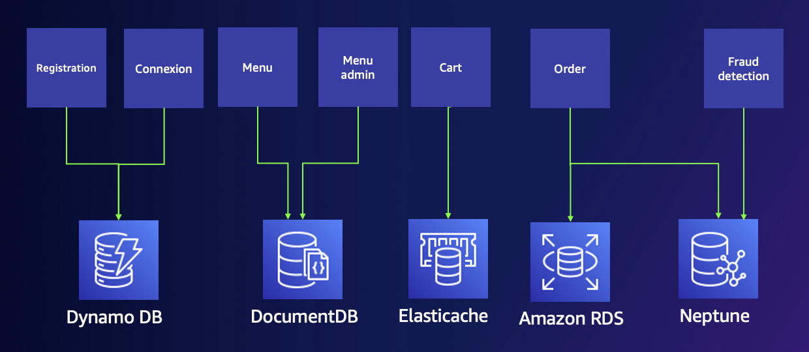

# Build a website with nosql database exemple 

## About this sample

> This sample is a web site using different technologies to resolve different use case when you build a web application using different AWS services 
    
### Overview

This sample demonstrates a Python application with FLASK ( this is a sample , you can make in other langage the same no problem ) 

This sample is a web site using different technologies to resolve different use case when you build a web application 
    Having an authentification module ( register , login management ... ) 
    Purpose menu/ Product to select ( with admin part and user part ) 
    Store all the orders ( base on command by user , make simple stat ( number of order , amount spend ... ) 
    Having a fraud suspicious detection ( having the possiblity to detect a fraud , load the order  in bussiness logic different ) 
    Accelerate you web page with caching ( the product or menu are ofter load )



WELCOME to Gemina trattoria  ( why gemina , this was the name of my Grand mother who teach me how to cook , and she was an incredible mediteranean grand mother with all the advantage you can imagine for his grandchildren) 


## How to run this sample

To run this sample, you'll need:

> An AWS account

> [AWS CLI](https://aws.amazon.com/cli/) installed and configured with your credential and an AWS region

> [Cdk](https://docs.aws.amazon.com/cdk/v2/guide/getting_started.html) installed 

> [Nodejs](https://nodejs.org/en/download/) including npm package manager


### Step 1:  Clone this repository

From your shell or command line:

```Shell
$ git clone https://github.com/emmanueldeletang/nosqlwebapp/
```


### Step 2:  Customize the menu

Open the Menu.json file and see a menu collection sample. 
You can modify the items to load your menu in the application. Make sure to check the url of the image for each meal. You can use your own S3 bucket to load meal's images.


### Step 3:  Deploy cdk stack
```Shell
$ cd nosqlwebapp/cdk/
$ npm install
$ cdk bootstrap
$ cdk deploy --outputs-file ./cdk-outputs.json
```
It takes approximately 30-45 minutes


### Step 4:  Access the demo application Gemina

After the entire stack is deployed, check the cdk-outputs.json file and access the webapplication url through your browser.
(Ex: "applicationlink": "ec2-xxxxxxxxx.<region>.compute.amazonaws.com:8080")

